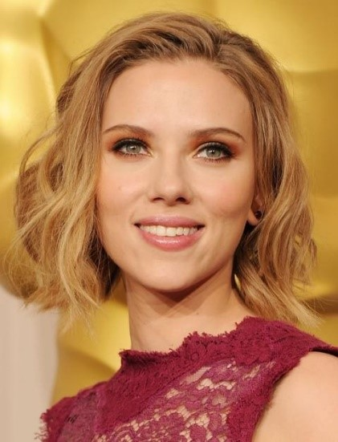
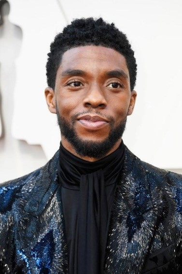
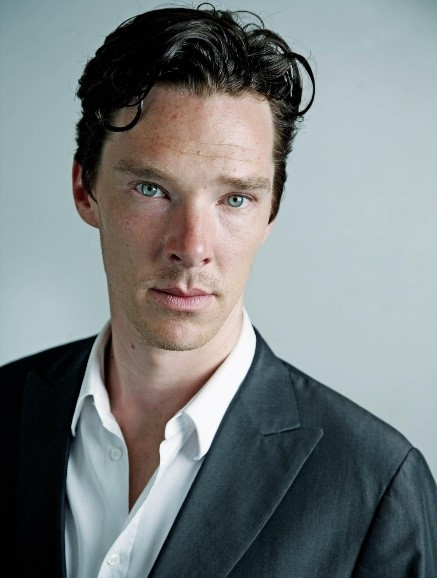
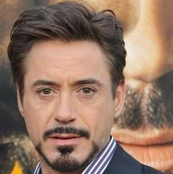
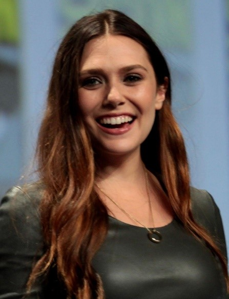
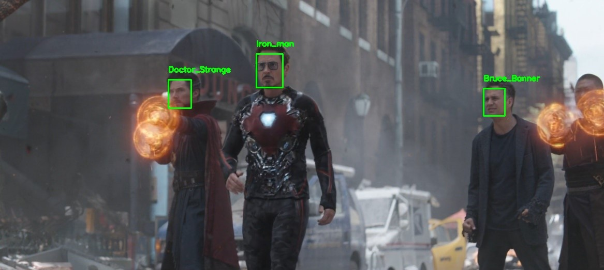
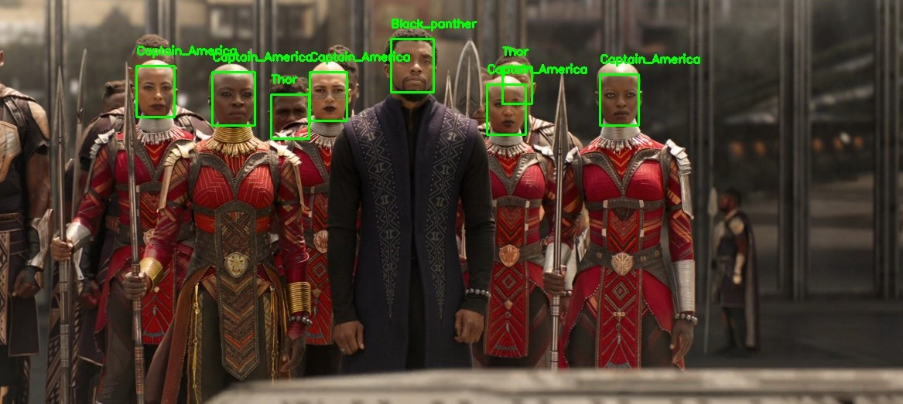
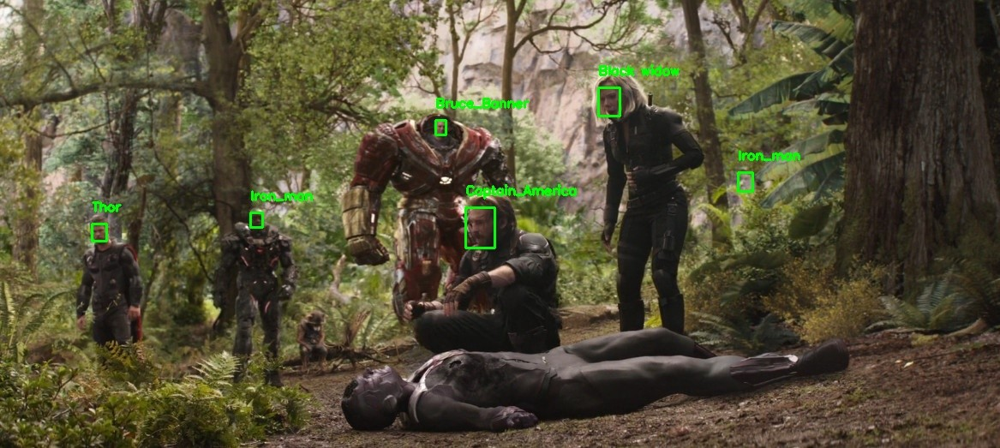

# Face-Recognition

---
## Datasets

The Avenger dataset is created by using `Google images download` [5][6].

| Character | #images |
| --------- | --------- |
||79|
||100|
||127|
||94|
||156|
||110|
||127|
||142|
||134|
||145|

---
## Methods
- Use MTCNN [2] for face detection.
- Extract face embedding vector by FaceNet [1].
- Use SVM [4] for classifying 10 classes/characters.

---
## How to run
`python recognize_faces.py --image <path to one input image> --encodings <path to pickle file that store all extracted embeddings of the dataset>`

---
## Result images:

---
## References
[1] https://github.com/ageitgey/face_recognition

[2] https://github.com/davidsandberg/facenet

[3] https://www.pyimagesearch.com/2018/06/18/face-recognition-with-opencv-python-and-deep-learning/

[4] https://scikit-learn.org/stable/modules/generated/sklearn.svm.LinearSVC.html#sklearn.svm.LinearSVC

[5] https://forum.machinelearningcoban.com/t/crawl-nhanh-hinh-anh-tu-google-image-cho-bat-ki-chu-de-nao-ban-can/2510

[6] https://github.com/hardikvasa/google-images-download
